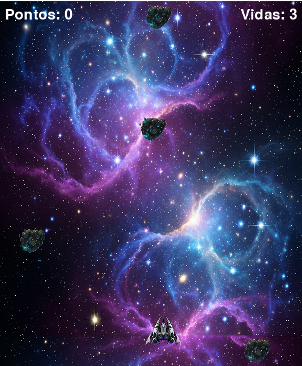

# Guerra Estelar



## Descrição do Projeto

Este é um jogo 2D de tiro espacial (shoot 'em up) desenvolvido como parte da Atividade Prática da disciplina de **Linguagem de Programação Aplicada**. O jogador controla uma nave que deve proteger a Terra, destruindo meteoros que se aproximam. O jogador perde vidas se for atingido ou se deixar um meteoro passar.
---

### Funcionalidades

* **Menu Principal:** Tela inicial para começar o jogo.
* **Gameplay de Tiro:** A nave pode se mover horizontalmente e atirar projéteis.
* **Inimigos:** Meteoros aparecem periodicamente no topo da tela.
* **Sistema de Vidas e Pontuação:** O jogador tem 3 vidas e ganha pontos ao destruir inimigos. Perde uma vida ao ser atingido ou ao deixar um meteoro passar pela linha de defesa.
* **Tela de Game Over:** Ao perder todas as vidas, uma tela de fim de jogo é exibida com a pontuação final e a opção de reiniciar.
* **Áudio:** O jogo conta com música de fundo e efeitos sonoros para tiros.
* **Estrutura Organizada:** O código foi desenvolvido utilizando o paradigma de Programação Orientada a Objetos, com as classes separadas em módulos dentro de um pacote.

---

### Tecnologias Utilizadas

* **Linguagem:** Python 3
* **Biblioteca Principal:** Pygame

---

### Como Executar

**1. A partir do Código Fonte:**

* Clone o repositório.
* Crie um ambiente virtual e instale as dependências:
    ```bash
    pip install -r requirements.txt
    ```
* Execute o jogo:
    ```bash
    python main.py
    ```

**2. A partir do Executável (`.exe`):**

* Navegue até a pasta `dist`.
* Execute o arquivo `main.exe`.

---

**Criado por:** Giane Costa